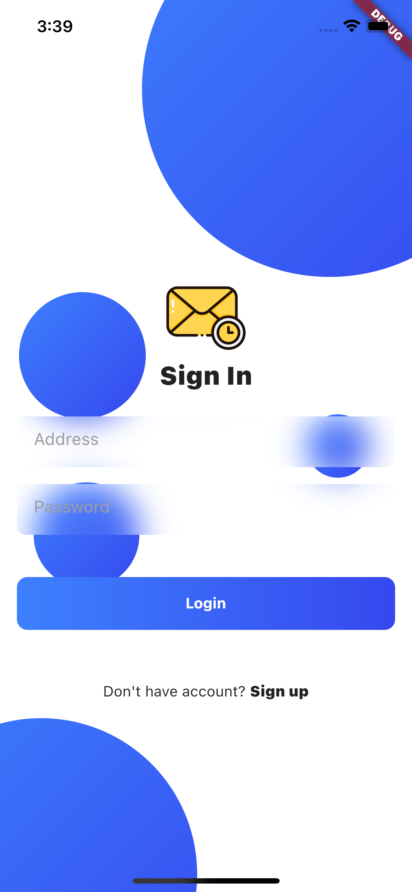
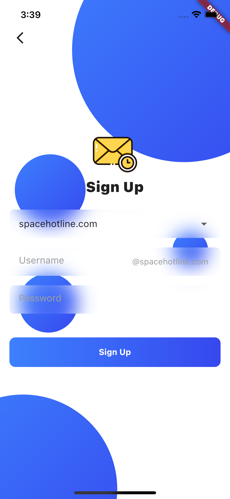
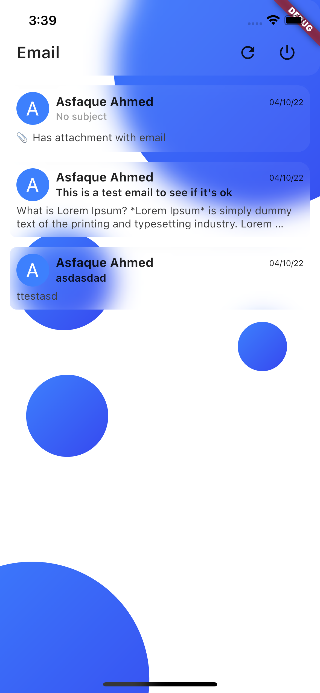
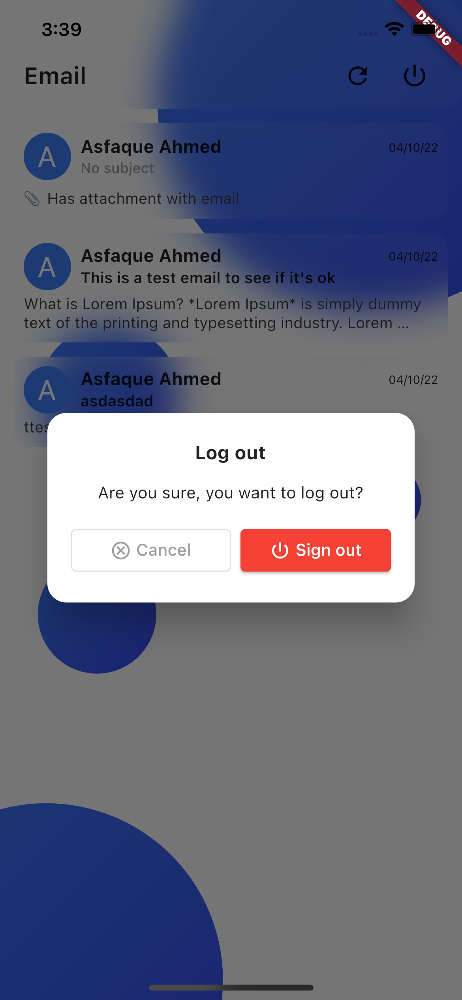
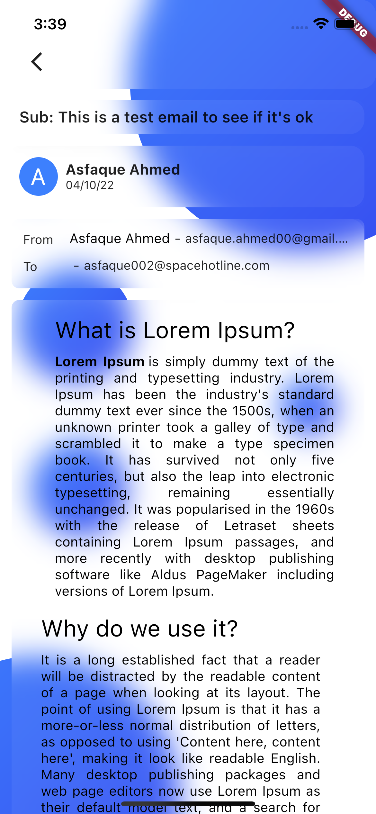

- Apk link: https://drive.google.com/file/d/14SANK2COP-S_h3z1qeQXDzqOkiw7f7uY/view?usp=sharing

- Dependencies:
    - get: to manage state
    - get_storage: storing token of the user
    - material_dialogs: To show dialog
    - flutter_html: To show any html content in received mail

- Screenshots:

- 
- 
- 
- 
- 